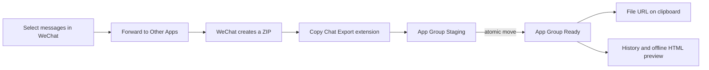

# macOS WeChat Chat Exporter

A minimal, local-only macOS utility that receives chat ZIP files from WeChat's
**Forward to Other Apps** feature and puts the durable ZIP on the clipboard.

## Features

- One macOS Share Extension: **Copy Chat Export**
- Durable App Group storage with atomic `Staging -> Ready` delivery
- File-URL clipboard output, ready to paste into any compatible app
- Local export history with copy, reveal and delete actions
- ZIP names use up to two distinct message authors, total participant count, and message date range (not an inferred group name). Unreadable transcripts fall back to the export date. Existing records migrate on load, retaining the old file link for previously copied URLs.
- Configurable automatic cleanup
- Offline HTML preview of WeChat's text transcript
- Normal Dock app and persistent main window
- No analytics, account login, updater, HTTP client or network dependency

## How it works



The extension copies the temporary file before macOS deletes it, writes a small
metadata file, and then atomically moves the complete batch into `Ready`. The
main app never reads WeChat's database and does not automate WeChat's UI.

## Requirements

- macOS 14 or newer
- Swift 6 toolchain / Xcode command-line tools
- WeChat for macOS with **Forward to Other Apps** support
- A valid macOS signing identity for reliable Share Extension registration

### App Group and signing

The host app and Share Extension use the dedicated App Group
`377U5HWB3A.com.czm.macos-wechat-chat-exporter.shared`. Its prefix must match the
actual Team ID of the signing certificate. This is an Apple developer team ID,
not another application's identifier. Each project must use a distinct full
App Group identifier.

For macOS-only `<TeamID>.<group name>` groups, Apple does not require portal
registration or a provisioning profile. The build script verifies the signing
team and rejects mismatched groups or ad-hoc signing before replacing the app.
It prefers Developer ID Application, then Apple Development certificates.

## Build

```bash
Scripts/make-app.sh
```

For another signing team, explicitly override both the identity and group:

```bash
IDENTITY="YOUR_SIGNING_CERTIFICATE_SHA1" \
APP_ID=com.example.wechat-chat-exporter \
APP_GROUP=YOURTEAMID.com.example.wechat-chat-exporter.shared \
Scripts/make-app.sh
```

Changing the group changes the storage location. Existing files in the previous
container are not deleted or automatically imported. Copy needed exports through
Finder before retiring the old installation; do not delete another app's container.
The current Full Disk Access onboarding remains unchanged by this configuration fix.

### Production distribution

For distribution outside the Mac App Store:

1. Select your Apple Developer team and stable, app-specific bundle identifiers.
2. Configure the same dedicated App Group for the app and share extension.
   Apple recommends registered `group.` identifiers with matching provisioning
   profiles; the macOS-only Team-ID-prefixed format above is also supported.
   The current script supports only the latter format, without embedded profiles.
3. Build and test using your own signing identity, including share receipt,
   preview, clipboard paste, and access without Full Disk Access where supported.
4. Sign the extension and app with Developer ID Application, hardened runtime,
   and a secure timestamp; submit to Apple's notary service and staple the ticket.
5. Verify the downloaded package on a clean Mac before publishing it.

The current script creates a local signed build. It does not implement the full
production notarization workflow. Apple Development-signed builds are not a
replacement for Developer ID distribution.

References: [App Group authorization](https://developer.apple.com/documentation/xcode/accessing-app-group-containers),
[Notarization](https://developer.apple.com/documentation/security/notarizing-macos-software-before-distribution).

Install a locally built copy:

```bash
Scripts/install-dev-build.sh
```

Run tests:

```bash
swift test
```

Create a ZIP and SHA-256 checksum for a GitHub Release:

```bash
Scripts/package-app.sh
```

The script rebuilds the app, packages it under `dist/`, then extracts the ZIP and
verifies the bundled signatures. An Apple Development-signed package is a local
development preview, not a notarized public release; macOS may block a downloaded
copy. A Git tag alone does not produce an application download. Attach the ZIP
and checksum to the corresponding GitHub Release. GitHub Actions currently runs
tests only, because no signing credentials are configured on the repository.

## First launch

The app displays a permission guide before loading history or starting its refresh timer.
Use its buttons to open **System Settings → Privacy & Security → Full Disk Access**
and reveal the currently running app in Finder. Add that copy, enable it, and relaunch
if macOS requests it. Confirm the setting in the guide, then check the export directory.
On every launch and return to the foreground, the app opens the current user's
protected TCC database read-only and immediately closes it, without reading any
contents. This is a conservative capability probe, not a public API for querying
the Full Disk Access switch. Denied access returns to the guide even if setup was
previously completed; other failures are shown as inconclusive and also block entry.
The Continue button repeats this check before testing export storage read/write access.
Permission changes must be made by the user; relaunch after changing authorization.
If storage access fails later, automatic refresh stops and the guide reappears.
The guide is also available from the app's Settings. Configure the main app before
using the WeChat share extension; the extension cannot show this onboarding window.

## Storage

Exports live inside a project-specific directory in the application's dedicated
App Group container. Do not reuse another application's App Group: it would
grant both applications access to the same private container.

```text
macos-wechat-chat-exporter/
  Inbox/
    Staging/   incomplete imports; never shown in history
    Ready/     durable ZIP files and metadata
  Preview/     generated local HTML files
```

The clipboard contains a file URL pointing to the durable ZIP. It does not
contain the ZIP bytes themselves.

## Privacy

This repository contains no networking code or third-party runtime dependency.
Files stay in the local App Group container until the user deletes them or the
retention policy removes them. Pasting a ZIP into an online service is a
separate action governed by that service.

## License

MIT. See [LICENSE](LICENSE).
